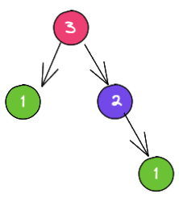

# SUPREME
Well, these are just notes...


Topics:
- JavaScript
- [TypeScript](#typescript)
    - [Generics](#generics)
- ReScript
- Functional Programming
- Object-oriented Programming
- [Algorithms](#algorithms)
    - [Recursion](#recursion)
        - [Tail-Recursion](#tail-recursion)
    - [Memoization](#memoization)
- Data Structures
- Miscellaneous


# TypeScript

<details>
<summary id="generics">
<h3>Generics</h3>
</summary>

Generics allow us to reuse code that can work with a variety of types

Example: 

Say we have a function that returns the length of a given array:

```typescript
let getLength = (arr: Array<string>) => arr.length;
```

This function can only operate on arrays and only array of strings.
What if we could reuse the same function to get the length of a custom data-structure or a string for say. In this case we would need to write another function for each different data-structure, and that's huh lame.

With generics, we can make the `getLength` function also work with strings or any data-structure as long as they have a `length` property.

```typescript
let getLength = <T extends {length: number}>(data: T) => data.length;

getLength("Hello, world!!"); // TS will infer the type;
getLength<Array<string>>(["Hello", "world!!"]); // 
```

`T` here is a type parameter, just like function parameter but for types, and you can have as many as you want. Whichever is the type of the parameter we pass to the function `getLength`, `T` will hold that information.

Let's push things a bit further, let's create a `reduce` function and make it generic:

```typescript
let reduce = (array: any, callback: any, initialValue: any) => array.reduce(callback, initialValue);
```
Well, the function is already generic and I'm using `any` to make it so, but if we use like this, we lose all typing information and validation. So, lemme fix it.

```typescript
let reduce = <T, I>(
    array: T[], 
    callback: (acc: I, value: T) => I, 
    initialValue: I
) => array.reduce(callback, initialValue);

let sum = reduce([2, 3, 4], (acc, value) => acc + value, 0);
sum // result here has type of number

let hello = reduce(['h', 'e', 'l', 'l', 'o'], (acc, value) => acc + value, '');
hello // hello here has type of string
```

Here I have two type variables `T`and `I` and I could name them whatever I want, they'll hold the type information of my function parameter and could explicitly tell what they are or just let the compiler infer them.


We can also make generic `interfaces` and `classes`, here's how:

```typescript
interface GIdentity {
    <Value>(value: Value): Value
}

let identity = <Input>(a: Input): Input => a;
let identity2: GIdentity = identity;

identity2<string>("3");
```

```typescript
interface GIdentity<Value> {
    (value: Value): Value
}

let identity = <Input>(a: Input): Input => a;
let identity2: GIdentity<number> = identity;

identity2(3);
```

```typescript
class DataBase<T> {
    value: T;
    constructor(value: T) {
        this.value = value
    }
    get(): T {
        return this.value;
    }
}

const db = new DataBase("2");
console.log(db.get());
```

</details>


# Algorithms

<details>
<summary id="recursion">
<h3>Recursion</h3>
</summary>

Recursion is when a function calls itself(as a subroutine) until it can't, uhnnn..
A function to be considered recursive, it needs to follow two properties:

- It has to have a `base case` which will make it stop running infinitely
- It has to have a `recursive case` which will make it call itself until it reaches the `base case`


When we invoke functions, they get added to the Stack and once they're done running, they get removed from it. So if a recursive function doesn't have both properties, it'll be added to the Stack infinitely causing the Stack to overflow.

Here's the most famous recursive example: The Fibonacci sequece
In the Fibonacci sequence each number is the sum of the two preceding ones. Say we want to calculate the Fibonacci of 3:

```
F(3) = F(1) + F(2)
F(1) = 1
F(2) = F(1) + F(0)
F(1) = 1
F(0) = 0
```

However, after reaching thee bottom, we add together every resulting number from the F function, for F(3) it is: 0 + 1 + 2 = 2, so F(3) = 2

Representing this as a tree it would look like this:


Identifying the properties from a recursive function:
If we look closer, the bottom case will always be 0 or 1, so:

- `base case` identifies as: F(0) = 0 or F(1) = 1
- `recursive case` would then be n > 1: F(n) = F(n - 1) + F(n - 2)

```ts
let fib = (n: number): number => n < 2 ? n : fib(n - 1) + fib(n - 2);
```

Let's make one more recursive function, this time let's reverse an array of strings:

```ts
let str  = ['o', 't', 's', 'u', 'a', 'F'];
let reverse = ([head, ...tail]: string[]): string[] => {
    if(!tail.length) return [head];
    return [...reverse(tail), head];
}
```

Let's analyze the above algorithm and identify the properties of a recursive function:

The way this algorithm works it that:
- It destructures the input array and takes the first element and adds it into a stack.
- Then it calls itself with all the array elements but the first one.

So, our `base case` happens when we call the function with an empty array and the `recursive case` happens when do call the function with an array of elements.

## Tail-Recursion

Tail call is a call performed as the final action of a procedure [source](https://en.wikipedia.org/wiki/Tail_call).
If you take a look at the Fibonacci algorithm, you can see that the `recursive case` happens at the end of the function body:

```ts
let fib = (n: number): number => {
    if (n < 2) return n;
    let result = fib(n - 1) + fib(n - 2);
    // we could still do more stuff here
    return result;
}
```

Not every recursive function is or needs to be tail-recursive, in the example above, we could do more things if we wanted to and then return whatever we wanted to.

</details>

<details>
<summary id="memoization">
<h3>Memoization</h3>

Recursive algorithms sometimes do lots of duplicated calculations and stuff, and one way of avoid those duplicated calculations is to save them somewhere(memoize).

Memoization is a technique of saving previous calculations in order to avoid calculating them again and again, and we encouter a calculation that has already be done we don't need to do it again we simply return the previous result of the same.

In the recursive Fibonacci sequence, there's a lot of duplicated calculations. If we calculate the F(3) we can see duplicated calculations, they have the same color in the tree-representation, can you spot them?


Here's the same Fibonacci algorithm but this time it's memoized.

```ts
let fib = (n: number, memo: Record<number, number> = {}): number => {
    if(memo[n]) return memo[n];
    if (n < 2) return n;
    memo[n] = fib(n - 1) + fib(n - 2);
    return memo[n];
}
```

</summary>